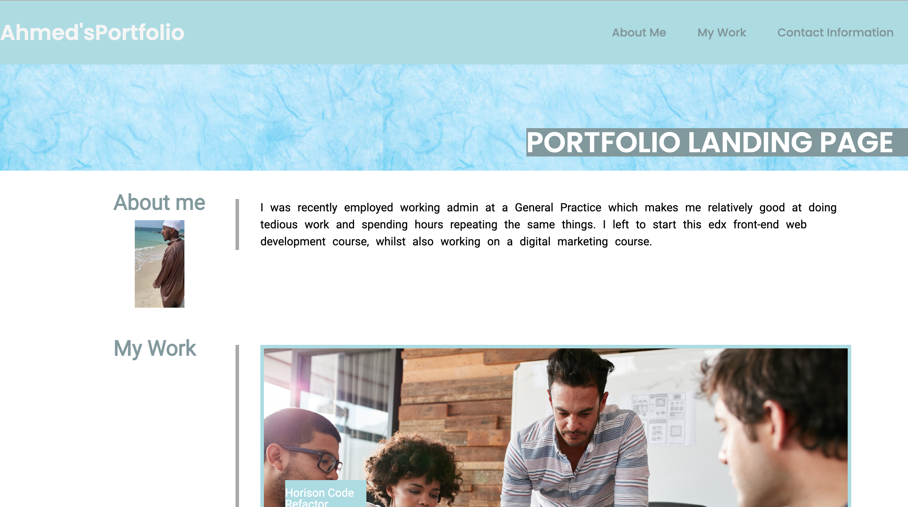

# ahmed-ibrahim-portfolio

The purpose of the landing page was to create a place to collate all my work in one place as a portfolio whilst providing further information about myself as well as contact information if they take interest. It was also to show an indication of what I can do currently with HTML/CSS

I made sure to include a styled nav and footer with working links to make the page scroll or take them to an email or phone number, an about me, a my work and contact information section to clearly show and seperate information. The code also contains all the different skills that we have learnt so far including CSS variables, CSS grid, Flexbox and more

